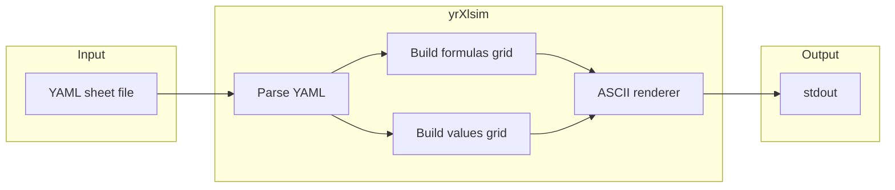

# Product Requirements Document: yrXlsim (Excel ASCII Sim CLI)

**Product name:** yrXlsim  
**Version:** 0.1 (draft)  
**Last updated:** 2025-02-03

---

## 1. Overview

yrXlsim is a cross-platform command-line tool that generates ASCII-art simulations of Excel spreadsheets from declarative files. It produces two views—**FORMULAS VIEW** (formula text in cells) and **VALUES VIEW** (evaluated values)—matching the style used in the author’s Quarto Excel notes (e.g. [excelNotes 0010225](https://y-rosenthal.github.io/excelNotes/0010225-randomValues-v001.html)).

The tool is intended for use when writing a book (or other documentation) in Quarto: authors define “spreadsheets” in human-editable YAML files and run the CLI to output ASCII grids suitable for inclusion in the book. Formula evaluation uses a full Excel-compatible engine so that classic and modern functions (e.g. IFS, COUNTIFS, XLOOKUP) are supported.

---

## 2. Goals and objectives

- **Primary:** Provide a single, Bash-invokable CLI that renders ASCII-art spreadsheet grids from a declarative file format.
- **Cross-platform:** Runnable from Bash on Windows, macOS, and Linux.
- **Full formula support:** Evaluate a broad set of Excel functions (classic and modern), not a small subset.
- **Authoring workflow:** Make it easy to create and modify “spreadsheets” via plain-text files and re-render from the command line or from Quarto.

---

## 3. Target output style

The tool MUST produce ASCII that matches the existing style used in the excelNotes HTML:

- **Row labels:** First column shows row numbers (1, 2, 3, …).
- **Column labels:** One line with column letters (A, B, C, …).
- **Grid:** Lines built from `+`, `-`, and `|`; cell content padded to fixed width so columns align.
- **Two views:** Same grid structure, with:
  - **FORMULAS VIEW:** Cell content is the formula text (e.g. `=RANDBETWEEN(1,6)`, `=A2+B2`).
  - **VALUES VIEW:** Cell content is the evaluated value (e.g. `2`, `5`, `7`).

The CLI MUST support rendering formulas only, values only, or both (e.g. two labeled blocks in one run).

---

## 4. Functional requirements

### 4.1 Input format

- **FR-1:** The tool SHALL read spreadsheet definitions from a declarative, file-based format.
- **FR-2:** The primary format SHALL be YAML: one file per sheet (e.g. `dice.yaml`), with a structure such as:
  - A `rows` key: list of rows; each row is a list of cell contents (formula or value).
  - Optional: cell-map style (e.g. `A1: "first die"`, `B2: "=RANDBETWEEN(1,6)"`) for sparse sheets.
- **FR-3:** An optional `values` block (or equivalent) MAY be supported to override specific cells with fixed results (e.g. for reproducible VALUES view in published material).
- **FR-4:** Alternative: a simple CSV-like format (one line per row, formula or value per column) MAY be supported as an alternative to YAML.

Example YAML (row-based):

```yaml
# dice.yaml
rows:
  - ["first die", "second die", "Total on both dice"]
  - ["=RANDBETWEEN(1,6)", "=RANDBETWEEN(1,6)", "=A2+B2"]
  - ["=RANDBETWEEN(1,6)", "=RANDBETWEEN(1,6)", "=A3+B3"]
```

### 4.2 Formula evaluation

- **FR-5:** VALUES view SHALL be produced by evaluating cell formulas using a full Excel-style formula engine.
- **FR-6:** The engine SHALL support a broad set of Excel functions, including but not limited to:
  - **Modern:** IFS, SWITCH, XLOOKUP, XMATCH, FILTER, UNIQUE, SORT, and other dynamic-array / lookup functions.
  - **Classic:** RANDBETWEEN, RAND, SUM, COUNTIF, COUNTIFS, SUMIF, IF, VLOOKUP, INDEX/MATCH, date/time, text, financial, statistical, etc.
- **FR-7:** Evaluation SHALL respect cell references and dependency order (spreadsheet-style calculation).
- **FR-8:** For reproducibility (e.g. in a book), the tool SHALL support at least one of: (1) optional seed for volatile functions (RAND, RANDBETWEEN), or (2) optional `values` override in the input file to fix specific cell results.

### 4.3 CLI behavior

- **FR-9:** The tool SHALL support at least the following commands:
  - `xlsim render <file>` — Read sheet from `<file>`, output ASCII to stdout (default: both views).
  - `xlsim render <file> --view formulas` — Output only FORMULAS VIEW.
  - `xlsim render <file> --view values` — Output only VALUES VIEW.
  - `xlsim render <file> --view both` — Output both views (e.g. two blocks with labels).
  - `xlsim init [name]` — Create a sample sheet file in the current directory (e.g. `dice.yaml`).
- **FR-10:** Output SHALL be to stdout by default so the tool can be used in shell pipelines and from Quarto bash chunks.
- **FR-11 (optional later):** `xlsim set <file> <cell> <value>` and/or `xlsim render <file> -o out.txt` MAY be supported.

### 4.4 Quarto integration

- **FR-12:** The tool SHALL be invokable from a Quarto bash chunk; output SHALL be suitable for inclusion as-is (e.g. with `#| echo: false` and `#| output: asis`) or by redirecting to a file and including the file.

---

## 5. Non-functional requirements

- **NFR-1 (Cross-platform):** The tool SHALL run on Windows, macOS, and Linux when invoked from a shell (e.g. Bash) with the same command pattern (e.g. `xlsim render file.yaml`).
- **NFR-2 (Portability):** The implementation SHALL use a language/runtime that is commonly available on all three platforms (recommendation: Python 3).
- **NFR-3 (Dependencies):** The tool MAY depend on a small set of well-maintained libraries (e.g. PyYAML, the `formulas` package); dependencies SHALL be clearly documented and installable via standard package managers (e.g. pip).

---

## 6. Technical approach

### 6.1 Tech stack (recommended)

- **Language:** Python 3.
- **Rationale:** Same script runs on Windows (`py` / `python`), macOS, and Linux (`python3`); Bash-friendly; fits Quarto/R/Python workflows; supports full formula engine via existing packages.
- **Formula engine:** Python package [formulas](https://formulas.readthedocs.io/) (vinci1it2000). Actively maintained (1.3.3, Python 3.6–3.13); supports IFS, XLOOKUP, RANDBETWEEN, COUNTIF/COUNTIFS, and a broad set of Excel functions. Install: `pip install formulas` (optional `pip install formulas[excel]` for .xlsx loading).
- **Input parsing:** YAML (e.g. PyYAML or stdlib-only if a minimal format is used). Optional CSV-like parser as alternative.
- **Delivery:** Single script `xlsim`/`xlsim.py` run with `python3 xlsim ...`, or a small package with `pip install .` and an `xlsim` entry point.

### 6.2 High-level architecture

- **Parse:** Load YAML (or CSV), build an in-memory grid (list of rows, each row list of cell strings).
- **Formulas grid:** Use cell contents as-is (formula text) for FORMULAS VIEW.
- **Values grid:** Evaluate each cell formula via the formula engine, respecting references and dependency order; optionally apply seed or `values` overrides for reproducibility.
- **ASCII renderer:** Given a grid and column widths (derived from content or configured), output the header line (column letters), then for each row the separator line and the row line (row number + cell contents). Use only `+`, `-`, and `|` for compatibility with any terminal and Quarto.



### 6.3 Suggested file layout

```
yrXlsim/
├── README.md           # How to run, examples, Quarto usage
├── pyproject.toml      # Optional: for pip install and xlsim entry point
├── xlsim.py            # Single script, or
├── xlsim/              # Or package layout
│   ├── __init__.py
│   ├── cli.py          # argparse / click
│   ├── sheet.py        # load sheet (YAML/CSV), grid model
│   ├── render.py       # grid -> ASCII
│   └── eval.py         # formula evaluation (formulas package)
└── examples/
    └── dice.yaml       # Sample sheet (e.g. RANDBETWEEN dice example)
```

Start with a single file (`xlsim.py`) and split into modules only if the codebase grows.

---

## 7. Summary of recommendations

| Topic     | Recommendation |
|----------|-----------------|
| **Stack** | Python 3, script or small package. |
| **Input** | YAML file (one per sheet) with `rows` (and optional `values`) structure. |
| **Output** | ASCII grid with column letters, row numbers, `+`/`-`/`\|` borders; FORMULAS and VALUES views. |
| **Formulas** | Use the **formulas** package for full Excel-style evaluation (IFS, COUNTIFS, XLOOKUP, RANDBETWEEN, refs, etc.). Optional seed or `values` override for reproducible VALUES view. |
| **CLI** | `xlsim render [--view formulas\|values\|both]`, `xlsim init [name]`. |
| **Quarto** | Call `xlsim render ...` from a bash chunk; optionally `#\| echo: false` and `#\| output: asis` to embed the ASCII. |

---

## 8. Out of scope (for initial release)

- Loading or saving native Excel (`.xlsx`) files as the primary workflow; YAML (or CSV-like) is the main input. Optional `.xlsx` loading may be considered later via `formulas[excel]`.
- Interactive or GUI editing of spreadsheets; editing is done by modifying the YAML/CSV file in an external editor.
- Real-time or reactive recalculation; the tool is run on demand (e.g. each time the author re-renders the book or runs the CLI).

---

## 9. Success criteria

- Author can define a spreadsheet in a YAML file (e.g. dice example with RANDBETWEEN and cell references) and run `xlsim render dice.yaml` to get ASCII FORMULAS VIEW and VALUES VIEW.
- Output visually matches the style of the existing excelNotes ASCII grids (column letters, row numbers, `+`/`-`/`|` grid).
- Tool runs from Bash on at least Windows, macOS, and Linux with the same command.
- Formulas such as `=RANDBETWEEN(1,6)`, `=A2+B2`, and (where applicable) `=IFS(...)`, `=XLOOKUP(...)`, `=COUNTIFS(...)` are evaluated correctly for VALUES view.
- Author can embed the tool’s output in a Quarto document (e.g. via a bash chunk or by redirecting output to a file and including it).
