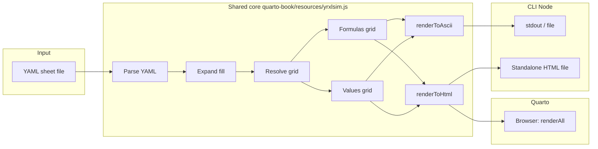

# Product Requirements Document: yrXlsim (Excel ASCII Sim CLI)

**Product name:** yrXlsim  
**Version:** 0.1 (draft)  
**Last updated:** 2025-02-09

This document combines **product requirements** and the **technical design plan** (goals, functional requirements, tech stack, CLI behavior, and Quarto integration) in one place.

---

## 1. Overview

yrXlsim is a declarative, YAML-based spreadsheet format with **one shared JavaScript core** used in two ways:

1. **Quarto (HTML)** — In-browser rendering: the same core runs inside Quarto-built HTML to turn `.yrxlsim` code blocks into Formulas and Values tables (with [HyperFormula](https://hyperformula.handsontable.com/) and [js-yaml](https://github.com/nodeca/js-yaml)).
2. **Bash/CLI (Node)** — Command-line rendering: the same core is run under Node.js to produce **(a)** ASCII-art grids for the terminal and documentation, and **(b)** standalone HTML files with bundled CSS (and optional JS) for viewing outside Quarto.

Formula evaluation uses a full Excel-compatible engine (HyperFormula) in both environments so that classic and modern functions (e.g. IFS, COUNTIFS, XLOOKUP, RANDBETWEEN) are supported. The tool is intended for use when writing books or docs in Quarto: authors define “spreadsheets” in human-editable YAML files and can render them in-browser (Quarto) or from the command line (ASCII or HTML).

---

## 2. Goals and objectives

- **Shared core:** One JavaScript codebase (`quarto-book/resources/yrxlsim.js`) used by both Quarto (browser) and the CLI (Node): parse YAML, expand fill, resolve grid, evaluate formulas (HyperFormula), render to HTML or ASCII.
- **Primary:** Provide a Bash-invokable CLI that renders yrXlsim YAML to **(a)** ASCII-art grids and **(b)** standalone HTML with bundled CSS (and optionally JS).
- **Cross-platform:** CLI runs via Node.js on Windows, macOS, and Linux; Quarto use is unchanged.
- **Full formula support:** Evaluate a broad set of Excel functions (classic and modern) in both browser and CLI.
- **Authoring workflow:** Create and edit sheets in YAML; re-render from the command line (ASCII/HTML) or in Quarto (HTML).

---

## 3. Target output style

The tool MUST produce ASCII that matches the existing style used in the excelNotes HTML:

- **Row labels:** First column shows row numbers (1, 2, 3, …).
- **Column labels:** One line with column letters (A, B, C, …).
- **Grid:** Lines built from `+`, `-`, and `|`; cell content padded to fixed width so columns align.
- **Two views:** Same grid structure, with:
  - **FORMULAS VIEW:** Cell content is the formula text (e.g. `=RANDBETWEEN(1,6)`, `=A2+B2`).
  - **VALUES VIEW:** Cell content is the evaluated value (e.g. `2`, `5`, `7`).

The CLI MUST support rendering formulas only, values only, or both (e.g. two labeled blocks in one run).

---

## 4. Functional requirements

### 4.1 Input format

- **FR-1:** The tool SHALL read spreadsheet definitions from a declarative, file-based format.
- **FR-2:** The primary format SHALL be YAML: one file per sheet (e.g. `dice.yaml`), with a structure such as:
  - A `rows` key: list of rows; each row is a list of cell contents (formula or value).
  - Optional: cell-map style (e.g. `A1: "first die"`, `B2: "=RANDBETWEEN(1,6)"`) for sparse sheets.
- **FR-3:** An optional `values` block (or equivalent) MAY be supported to override specific cells with fixed results (e.g. for reproducible VALUES view in published material).
- **FR-4:** Alternative: a simple CSV-like format (one line per row, formula or value per column) MAY be supported as an alternative to YAML.

Example YAML (row-based):

```yaml
# dice.yaml
rows:
  - ["first die", "second die", "Total on both dice"]
  - ["=RANDBETWEEN(1,6)", "=RANDBETWEEN(1,6)", "=A2+B2"]
  - ["=RANDBETWEEN(1,6)", "=RANDBETWEEN(1,6)", "=A3+B3"]
```

### 4.2 Formula evaluation

- **FR-5:** VALUES view SHALL be produced by evaluating cell formulas using a full Excel-style formula engine.
- **FR-6:** The engine SHALL support a broad set of Excel functions, including but not limited to:
  - **Modern:** IFS, SWITCH, XLOOKUP, XMATCH, FILTER, UNIQUE, SORT, and other dynamic-array / lookup functions.
  - **Classic:** RANDBETWEEN, RAND, SUM, COUNTIF, COUNTIFS, SUMIF, IF, VLOOKUP, INDEX/MATCH, date/time, text, financial, statistical, etc.
- **FR-7:** Evaluation SHALL respect cell references and dependency order (spreadsheet-style calculation).
- **FR-8:** For reproducibility (e.g. in a book), the tool SHALL support at least one of: (1) optional seed for volatile functions (RAND, RANDBETWEEN), or (2) optional `values` override in the input file to fix specific cell results.

### 4.3 CLI behavior

- **FR-9:** The CLI SHALL support at least:
  - `yrxlsim render <file>` — Read YAML from `<file>` (or stdin if `<file>` is `-`), output ASCII to stdout (default: both views).
  - `yrxlsim render <file> --format ascii` — Output ASCII grid(s) (FORMULAS and/or VALUES per `--view`).
  - `yrxlsim render <file> --format html` — Output a standalone HTML file with bundled CSS and pre-rendered table(s).
  - `yrxlsim render <file> --view formulas|values|both` — Which view(s) to output (default: both).
  - `yrxlsim render <file> -o <path>` — Write output to file instead of stdout.
  - (Optional later) `yrxlsim init [name]` — Create a sample sheet file.
- **FR-10:** ASCII output SHALL be to stdout by default for use in pipelines and Quarto bash chunks.
- **FR-11 (optional later):** `yrxlsim set <file> <cell> <value>` MAY be supported.

### 4.4 Quarto integration

- **FR-12:** The **same core** SHALL be used in Quarto: `.yrxlsim` code blocks are rendered in-browser by `quarto-book/resources/yrxlsim.js`. The CLI requires that same file and SHALL be invokable from a Quarto bash chunk for ASCII output; that output SHALL be suitable for inclusion as-is (e.g. `#| echo: false`, `#| output: asis`) or by redirecting to a file.

---

## 5. Non-functional requirements

- **NFR-1 (Shared core):** Quarto (browser) and the CLI (Node) SHALL use the same JavaScript codebase for parsing, fill, resolution, formula evaluation, and rendering logic. The core SHALL be environment-agnostic (browser vs Node) and receive YAML/ HyperFormula via the global object or equivalent.
- **NFR-2 (Cross-platform):** The CLI SHALL run on Windows, macOS, and Linux when invoked from a shell (e.g. `yrxlsim render file.yaml` or `node bin/yrxlsim.js render file.yaml`).
- **NFR-3 (Portability):** The core is JavaScript (browser + Node). The CLI is Node.js with dependencies (js-yaml, hyperformula) installable via npm.
- **NFR-4 (Dependencies):** Dependencies SHALL be clearly documented: for CLI, `npm install`; for Quarto, include js-yaml and HyperFormula (e.g. CDN) before the core script.

---

## 6. Technical approach

### 6.1 Tech stack (current)

- **Core:** Single JavaScript file `quarto-book/resources/yrxlsim.js` (single source of truth) that runs in both browser (Quarto) and Node.js (CLI). It parses YAML (via global `jsyaml`), expands fill, resolves grid, and uses **HyperFormula** (global) for formula evaluation. It exposes `buildEffectiveGrid`, `buildValuesGrid`, `renderToHtml`, `renderToAscii`, and (in browser) `renderAll` for `.yrxlsim` code blocks.
- **Quarto:** Book resources use that same file plus `yrxlsim.css` and a header that loads js-yaml and HyperFormula from CDN. The script runs on DOM ready and replaces `code.yrxlsim` blocks with Formulas and Values HTML.
- **CLI:** Node script `bin/yrxlsim.js` sets `global.jsyaml` and `global.HyperFormula`, then `require('quarto-book/resources/yrxlsim.js')`. It reads YAML from file or stdin and outputs ASCII (default) or writes a standalone HTML file with bundled CSS. A self-contained executable can be built with `pkg` (e.g. `npm run build` → `dist/`).
- **Input:** YAML per [YAML-SPEC-v0.0.2.md](YAML-SPEC-v0.0.2.md) (rows, cells, fill, values, meta).

### 6.2 High-level architecture

- **One core:** Parse YAML → expand fill → resolve grid → formulas grid (as-is) and values grid (HyperFormula + optional `values` override).
- **Two consumers:** (1) Browser: core renders HTML and replaces code blocks. (2) CLI: core renders ASCII or CLI builds standalone HTML with core’s HTML output and bundled CSS.
- **ASCII renderer:** In core: given a grid and column widths, output column letters, row numbers, and `+`/`-`/`|` grid; support FORMULAS VIEW and VALUES VIEW (one or both).



### 6.3 File layout

```
yrXlsim/
├── README.md
├── package.json        # npm deps; scripts: build (pkg), render:ascii, render:html
├── bin/
│   ├── yrxlsim         # Bash wrapper
│   └── yrxlsim.js      # Node CLI (requires quarto-book/resources/yrxlsim.js)
├── quarto-book/
│   └── resources/
│       ├── header.html # Loads js-yaml, HyperFormula, yrxlsim.js
│       ├── yrxlsim.css
│       └── yrxlsim.js  # Single source of truth (Quarto + CLI)
└── Examples/
    └── *.yaml
```

Edit `quarto-book/resources/yrxlsim.js` only; no sync step. Build a self-contained binary with `npm run build` (pkg).

---

## 7. Design plan (technical detail)

This section adds implementation-focused detail that complements the requirements above. The authoritative input format is [YAML-SPEC-v0.0.2.md](YAML-SPEC-v0.0.2.md).

### 7.1 CLI commands

| Command | Purpose |
|--------|--------|
| `yrxlsim render <file>` | Read YAML from `<file>` (or stdin if `-`), output ASCII (both views) to stdout. |
| `yrxlsim render <file> --format ascii` | ASCII grid(s); use `--view formulas\|values\|both` to choose view(s). |
| `yrxlsim render <file> --format html` | Standalone HTML file with bundled CSS and pre-rendered Formulas/Values tables. |
| `yrxlsim render <file> -o <path>` | Write output to file. |
| (Optional) `yrxlsim init [name]` | Create a sample sheet file. |

### 7.2 Quarto integration (ASCII in the book)

- **In-browser:** The same core (`yrxlsim.js` in book resources) runs on page load and replaces `.yrxlsim` code blocks with Formulas and Values HTML.
- **ASCII in the book:** Use a bash chunk to run the CLI and include ASCII output:

  ````markdown
  ```{bash}
  #| echo: false
  #| output: asis
  yrxlsim render dice.yaml
  ```
  ````

  Or redirect to a file and include it. The CLI prints to stdout by default.

---

## 8. Summary of recommendations

| Topic     | Recommendation |
|----------|-----------------|
| **Core** | Single JavaScript codebase (`quarto-book/resources/yrxlsim.js`) for Quarto (browser) and CLI (Node). |
| **Stack** | JavaScript (browser + Node); CLI uses Node with npm (js-yaml, hyperformula). |
| **Input** | YAML per spec: `rows`, `cells`, `fill`, `values`, `meta`. |
| **Output** | **ASCII:** column letters, row numbers, `+`/`-`/`\|` borders; FORMULAS and VALUES views. **HTML:** standalone file with bundled CSS and pre-rendered tables (or in Quarto, live render from code blocks). |
| **Formulas** | HyperFormula in both browser and Node for full Excel-style evaluation; optional `meta.seed` and `values` override for reproducibility. |
| **CLI** | `yrxlsim render <file> [--format ascii\|html] [--view formulas\|values\|both] [-o path]`. |
| **Quarto** | Same core in book resources; `.yrxlsim` code blocks rendered in-browser. For ASCII in the book, call `yrxlsim render ...` from a bash chunk with `#\| output: asis`. |

---

## 9. Out of scope (for initial release)

- Loading or saving native Excel (`.xlsx`) files as the primary workflow; YAML (or CSV-like) is the main input. Optional `.xlsx` loading may be considered later via `formulas[excel]`.
- Interactive or GUI editing of spreadsheets; editing is done by modifying the YAML/CSV file in an external editor.
- Real-time or reactive recalculation; the tool is run on demand (e.g. each time the author re-renders the book or runs the CLI).

---

## 10. Success criteria

- Author can define a spreadsheet in a YAML file (e.g. dice example with RANDBETWEEN and cell references) and run `xlsim render dice.yaml` to get ASCII FORMULAS VIEW and VALUES VIEW.
- Output visually matches the style of the existing excelNotes ASCII grids (column letters, row numbers, `+`/`-`/`|` grid).
- Tool runs from Bash on at least Windows, macOS, and Linux with the same command.
- Formulas such as `=RANDBETWEEN(1,6)`, `=A2+B2`, and (where applicable) `=IFS(...)`, `=XLOOKUP(...)`, `=COUNTIFS(...)` are evaluated correctly for VALUES view.
- Author can embed the tool’s output in a Quarto document (e.g. via a bash chunk or by redirecting output to a file and including it).
