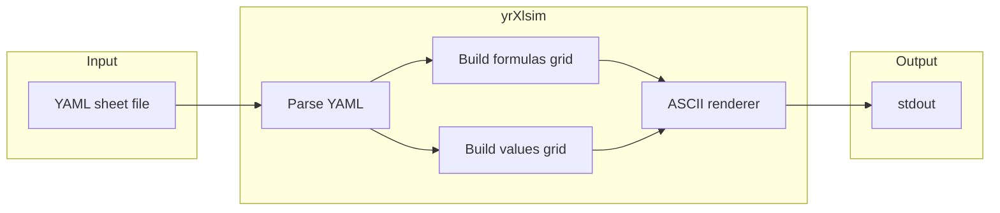

# Excel ASCII Sim CLI (yrXlsim) – Design Plan

## Goal

A Bash-invokable CLI that produces ASCII-art spreadsheet grids like those on [your excelNotes page](https://y-rosenthal.github.io/excelNotes/0010225-randomValues-v001.html): column letters (A, B, C…), row numbers (1, 2, 3…), `+`/`-`/`|` borders, and two outputs—**FORMULAS VIEW** (formula text in cells) and **VALUES VIEW** (evaluated values). You can create or edit "spreadsheets" via human-editable files and render them from the command line (and from Quarto).

---

## 1. Tech stack recommendation

**Use Python 3** as the implementation language.


| Criterion          | Why Python                                                                                                                        |
| ------------------ | --------------------------------------------------------------------------------------------------------------------------------- |
| **Cross-platform** | Same script runs on Windows (`py` / `python`), macOS, and Linux (`python3`). No separate binaries.                                |
| **Bash-friendly**  | Invoke as `xlsim render sheet.yaml`; output to stdout so you can pipe or redirect.                                                |
| **Easy to edit**   | You (and co-authors) can tweak sheet files in any editor; no GUI required.                                                        |
| **Portability**    | Can be written to use only the **stdlib** (no pip) for max portability, or one small dependency (e.g. PyYAML) if you prefer YAML. |
| **Quarto**         | Fits common Quarto workflows (R/Python); you can call the script from a bash chunk and capture output.                            |


**Alternatives considered**

- **Node.js**: Same "runs everywhere" story, but less typical for this kind of data/CLI in a book context.
- **Shell-only**: Hard to do robust parsing, formula evaluation, and pretty grids.
- **Compiled (Rust/Go)**: Single binary is nice but more work to build and to change; overkill for a book tool.

**Delivery**: Either a single script `xlsim` (or `xlsim.py`) that you run with `python3 xlsim ...`, or a small package installable with `pip install .` and an `xlsim` entry point. For a book repo, a single script in the repo is often enough.

---

## 2. Target output style (match your webpage)

The tool should produce ASCII that matches the style already used in your HTML, for example:

- **Row labels**: First column is row numbers (1, 2, 3 …).
- **Column labels**: One line with column letters (A, B, C …).
- **Grid**: Lines built from `+`, `-`, and `|`; cell content padded to fixed width so columns align.
- **Two views**: Same grid structure, but:
  - **FORMULAS VIEW**: Cell content is formula text (e.g. `=RANDBETWEEN(1,6)`, `=A2+B2`).
  - **VALUES VIEW**: Cell content is the evaluated value (e.g. `2`, `5`, `7`).

So the CLI must support "render formulas" and "render values" (and optionally "both" for two blocks in one run).

---

## 3. Functionality design

### 3.1 Defining a spreadsheet (input format)

Use a **declarative, file-based** format so that:

- Sheets are easy to **create** (template or by hand).
- Sheets are easy to **modify** (edit the file; re-run the tool).
- Content is **version-control friendly** (plain text).

**Recommended: YAML**

- One file per "workbook" or "sheet" (e.g. `dice.yaml`, `rand-between.yaml`).
- Structure: list of rows; each row is a list of cell contents. Optionally support a **cell map** (e.g. `A1: "first die"`, `B2: "=RANDBETWEEN(1,6)"`) for sparse sheets or clarity.
- Example (row-based, dense):

```yaml
# dice.yaml
rows:
  - ["first die", "second die", "Total on both dice"]
  - ["=RANDBETWEEN(1,6)", "=RANDBETWEEN(1,6)", "=A2+B2"]
  - ["=RANDBETWEEN(1,6)", "=RANDBETWEEN(1,6)", "=A3+B3"]
  # ...
```

- **Optional**: Allow a `values` block (or a separate file) to **freeze** VALUES view to specific numbers so the book output is reproducible without implementing a full formula engine.

**Alternative**: A simple **CSV-like** format (e.g. one line per row, commas/tabs, formula or value per cell). Easier to parse without dependencies but less flexible for multi-line or complex content.

### 3.2 Formula handling (VALUES view)

Use a **full Excel formula engine** so the tool can evaluate **any** classic and modern Excel functions—not just a small subset.

**Recommended engine: Python [formulas](https://formulas.readthedocs.io/) (vinci1it2000)**

- Actively maintained (1.3.3, Python 3.6–3.13).
- Supports a broad set of Excel functions, including:
  - **Modern:** IFS, SWITCH, XLOOKUP, XMATCH, FILTER, UNIQUE, SORT, and other dynamic-array / lookup functions.
  - **Classic:** RANDBETWEEN, RAND, SUM, COUNTIF, COUNTIFS, SUMIF, IF, VLOOKUP, INDEX/MATCH, date/time, text, financial, statistical, etc.
- Parses and compiles formulas; can execute workbook-style calculations with cell references and dependency order.
- Install: `pip install formulas` (optional `pip install formulas[excel]` for loading real .xlsx workbooks if you ever want that).

**VALUES view**: Compute by evaluating each cell formula via the engine, using the grid's current values and dependency order. No need to hand-maintain a separate "values" grid unless you want to freeze output.

**Reproducibility (e.g. for the book):** Volatile functions (RAND, RANDBETWEEN) change each run. Options: (1) Use an optional **seed** in the tool or engine if supported, so VALUES view is reproducible; (2) Or allow an optional **values** block in the YAML to override specific cells with fixed results for publication.


**Recommendation (obsolete)**: Start with **(1)** — two sources of truth (formulas + values) in the same file or side-by-side. Add **(2)** later if you want "one source of truth" and optional randomness with seed.

### 3.3 CLI commands


| Command                               | Purpose                                                                                               |
| ------------------------------------- | ----------------------------------------------------------------------------------------------------- |
| `xlsim render <file>`                 | Read sheet from `<file>`, output ASCII to stdout.                                                     |
| `xlsim render <file> --view formulas` | Only FORMULAS VIEW.                                                                                   |
| `xlsim render <file> --view values`   | Only VALUES VIEW.                                                                                     |
| `xlsim render <file> --view both`     | Both views (e.g. two blocks, with labels). Default can be `both`.                                     |
| `xlsim init [name]`                   | Create a sample sheet file (e.g. `dice.yaml`) in the current directory so you can edit and re-render. |


**Optional later**:

- `xlsim set <file> <cell> <value>` to set one cell from the command line (convenience for scripting).
- `xlsim render <file> -o out.txt` to write to a file (otherwise stdout is enough for Quarto).

### 3.4 Quarto integration

- In a `.qmd` file, use a **bash** chunk to run the tool and capture the ASCII:
  ```markdown
  ```{bash}
  #| echo: false
  #| output: asis
  xlsim render dice.yaml
  ```
  ```

  ```
- Or run in the shell and paste the output into a fenced code block (with a label like "FORMULAS VIEW" / "VALUES VIEW" as on your page). Either way, the tool only needs to print to stdout.

---

## 4. High-level architecture




- **Parse**: Load YAML (or CSV), build an in-memory grid (e.g. list of rows, each row list of strings).
- **Formulas grid**: Use cell contents as-is (formula text).
- **Values grid**: Either from explicit `values` in the file, or from optional formula evaluation (with optional seed).
- **ASCII renderer**: Given a grid + column widths (or auto from content), print the header line (column letters), then for each row print the separator line and the row line (row number + cell contents). Use `+`, `-`, `|` only so it works in any terminal and in Quarto.

---

## 5. File layout (suggested)

```
yrXlsim/
├── README.md           # How to run, examples, Quarto usage
├── pyproject.toml      # Optional: for pip install and xlsim entry point
├── xlsim.py            # Single script, or
├── xlsim/              # Or package layout
│   ├── __init__.py
│   ├── cli.py          # argparse / click
│   ├── sheet.py        # load sheet (YAML/CSV), grid model
│   ├── render.py       # grid -> ASCII
│   └── eval.py         # optional: formula evaluation
└── examples/
    └── dice.yaml       # Sample sheet (from your RANDBETWEEN dice example)
```

You can start with a **single file** (`xlsim.py`) and split into modules only if it grows.

---

## 6. Summary of recommendations


| Topic        | Recommendation                                                                                                                                                                   |
| ------------ | -------------------------------------------------------------------------------------------------------------------------------------------------------------------------------- |
| **Stack**    | Python 3, script or small package; stdlib-only possible.                                                                                                                         |
| **Input**    | YAML file (one per sheet) with a `rows` (and optional `values`) structure.                                                                                                       |
| **Output**   | ASCII grid with column letters, row numbers, `+`/`-`/`                                                                                                                           |
| **Formulas** | Use the **formulas** package for full Excel-style evaluation (IFS, COUNTIFS, XLOOKUP, RANDBETWEEN, refs, etc.). Optional seed or `values` override for reproducible VALUES view. |
| **CLI**      | `xlsim render [--view formulas                                                                                                                                                   |
| **Quarto**   | Call `xlsim render ...` from a bash chunk; optionally `#                                                                                                                         |


This gives you a single, Bash-runnable tool on Windows, Mac, and Linux that matches the look of your existing Excel-style ASCII art and keeps creating/editing simple via text files.
